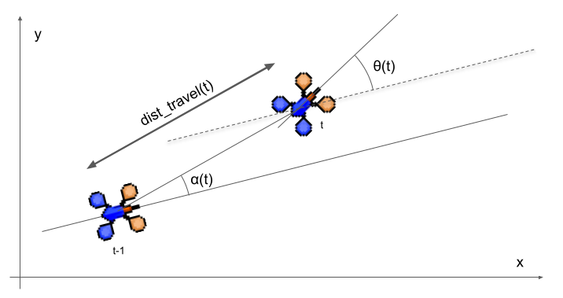

# Table of Content

- [Welcome to *Swarm-Rescue*](#welcome-to-swarm-rescue)
- [The Competition](#the-competition)
- [Simple-Playgrounds](#simple-playgrounds)
- [Installation on Ubuntu](#installation-on-ubuntu)
- [Installation on Windows 10](#installation-on-windows-10)
- [Elements of the environment](#elements-of-the-environment)
- [Programming](#programming)
- [Contact](#contact)

# Welcome to *Swarm-Rescue*

With this project, you will try to save human lives, in simulation... Teach a swarm of drones how to behave to save a maximum of injured people in a minimum of time!

Your job will be to propose your own version of the controller of the drone. In a competition, each participating team will perform on a new unknown map, the winner will be the one who gets the most points based on several criteria: speed, quality of exploration, number of injured people saved, number of drones returned, etc.

*Swarm-Rescue* is the environment that simulates the drones and that describes the maps used, the drones and the different elements of the map.

[Access to the GitHub repository *Swarm-Rescue*](https://github.com/emmanuel-battesti/swarm-rescue)

The Challenge does not require any particular technical skills (beyond basic knowledge of *Python*), and will mainly mobilize creativity and curiosity from the participants.

# The Competition

The objective of the mission is to map an unknown, potentially hostile area, detect targets (injured or healthy people), and guide them out of the area. A typical use case is to investigate the basement of a collapsed building in the dark, in order to locate trapped people and rescue them.

Each team will have a fleet of 10 drones. Each drone will be equipped with communication functions and sensors.

**Your job is to make these drones completely autonomous by programming them in *Python*.**

The drones will have to manage the limited range of the communication means, collaborate between them to acquire information and share information, be able to manage sensor and communication means failures and unforeseen events such as the loss of drones in order to conduct this mission autonomously.

The work on the challenge will be done **exclusively in this simulation environment**, with maps of increasing complexity. The final evaluation will be done on several unknown maps designed by the organizers and not available to the contestants. Every proposition will be tested on a same computer and a score related to the performance will be computed.


## Score

Depending on the scenario evolution before the final evaluation, the score calculation may be slightly modified. The general calculation principle for one map configuration is explained below. 

First, the execution of your algorithms will be stopped after a while. There are two time-limits:
- time step limit: a number of loops in the simulation
- real time limit: a limit in minutes, depending on the map and the computer speed: 2 to 5 minutes.

When the first limit is reached, the game is over. If your algorithm is fast, you will reach the "step time limit" first. If your algorithm is too slow, you will reach the "real time limit" before the "time step limit" .

To calculate the score, the following elements will be taken into account:
- the part of the territory explored: you have to explore a maximum of the map
- the number of fixed targets detected, brought back to the base,
- the number of mobile targets detected, brought back to the base.

If all the targets are brought back to base and all the map is explored, the speed in "time step" will be taken into account.

# Simple-Playgrounds 

This program *Swarm-Rescue* is an extension of the *Simple-Playgrounds* (SPG) software library: [https://github.com/mgarciaortiz/simple-playgrounds](https://github.com/mgarciaortiz/simple-playgrounds). However, in the current installation of *Swarm-Rescue*, it is the branch *swarm-rescue-v2* of a fork of *Simple-Playgrounds* that is used: [https://github.com/emmanuel-battesti/simple-playgrounds](https://github.com/emmanuel-battesti/simple-playgrounds).


It is recommended to read the [documentation of *Simple-Playgrounds*](https://github.com/emmanuel-battesti/simple-playgrounds#readme).

*Simple-Playgrounds* is an easy-to-use, fast and flexible simulation environment. It bridges the gap between simple and efficient grid environments, and complex and challenging 3D environments. It proposes a large diversity of environments for embodied drones learning through physical interactions. The playgrounds are 2D environments where drones can move around and interact with scene elements.

The game engine, based on [Pymunk](http://www.pymunk.org) and [Arcade](https://api.arcade.academy/), deals with simple physics, such as collision and friction. Drones can act through continuous movements and discrete interactive actions. They perceive the scene with realistic first-person view sensors, top-down view sensors, and semantic sensors.

## Game Engine

In *Simple-Playgrounds*, the game engine used is *Arcade*. Drones enter a Playground, and start acting and perceiving within this environment. The perception/action/communication loop is managed by the game engine. At each time step, all perception is acquired, all communication are done. Then according to actions to do, drones are moved. Everything is synchronized, unlike what you would get on a real robot.

## Physics Engine

In *Simple-Playgrounds*, the 2d physics library *Pymunk* is used. The physic engine deals with simple physics, such as collision and friction. This gives a mass and inertia to all objects.


# Installation on Ubuntu

This installation procedure has been tested with Ubuntu 18.04 and 20.04.

## Arcade library dependencies

First, you will obviously have to use the Git tool.

And for the library *Arcade*, you might need to install *libjpeg-dev* and *zlib1g-dev*.

```bash
sudo apt update
sudo apt install git libjpeg-dev zlib1g-dev
```

## *Python* installation

We need, at least, *Python 3.8*.

- On *Ubuntu 20.04*, the default version of *Python* is 3.8.
- On *Ubuntu 18.04*, the default version of *Python* is 2.7.17. And the default version of *Python3* is 3.6.9.

But it is easy to install *Python* 3.8:
```bash
sudo apt update
sudo apt install python3.8 python3.8-venv python3.8-dev
```

## *Pip* installation

- Install *Pip*:

```bash
sudo apt update
sudo apt install python3-pip 

- When the installation is complete, verify the installation by checking the *Pip* version:

```bash
pip3 --version
```

- It can be useful to upgrade *Pip* to have the last version in local directory:

```bash
/usr/bin/python3.8 -m pip install --upgrade pip
```

To use the correct version, you have to use `python3.8 -m pip` instead of `pip`, for example:

```bash
python3.8 -m pip --version
```

## Virtual environment tools

The safe way to work with *Python* is to create a virtual environment around the project.

For that, you have to install some tools:

```bash
sudo apt update
sudo apt install virtualenvwrapper
```
## Install this *swarm-rescue* repository

- To install this git repository, go to the directory you want to work in (for example: *~/code/*).

- Git-clone the code of [*Swarm-Rescue*](https://github.com/emmanuel-battesti/swarm-rescue):

```bash
git clone https://github.com/emmanuel-battesti/swarm-rescue.git
```
This command will create the directory *swarm-rescue* with all the code inside it.

- Create your virtual environment. This command will create a directory *env* where all dependencies will be installed:

```bash
cd swarm-rescue
python3.8 -m venv env
```

- To use this newly create virtual environment, as each time you need it, use the command:

```bash
source env/bin/activate
```

To deactivate this virtual environment, simply type: `deactivate`

- With this virtual environment activated, we can install all the dependency with the command:

```bash
python3.8 -m pip install --upgrade pip
python3.8 -m pip install -r requirements.txt
```

- To test, you can launch:

```bash
python3.8 ./src/swarm_rescue/launcher.py
```

## Python IDE

Although not mandatory, it is a good idea to use an IDE to code in *Python*. It makes programming easier.

For example, you can use the free *community* version of [*PyCharm*](https://www.jetbrains.com/pycharm/). In this case, you have to set your *interpreter* path to your venv path to make it work. 


# Installation on Windows 10

This installation procedure has been tested with Windows 10. Installation is also straightforward on Windows 11.

## *Python* installation

- Open this link in your web browser:  https://www.python.org/downloads/windows/
- Don't choose the latest version of Python, but choose the 3.8 version. Currently (11/2022), it is the "*Python 3.8.10 - May 3, 2021*".
- For modern machine, you have to choose the *Windows x86-64 executable installer*.
- Once the installer is downloaded, run the Python installer.
- **Important**: you need to check the "**Add Python 3.8 to path**" check box to include the interpreter in the execution path.

## *Git* installation

Git is a tool for source code management. [Git is used](https://www.simplilearn.com/tutorials/git-tutorial/what-is-git "Git is used") to tracking changes in the source code of *swarm-rescue*.

 - Download the [latest version of Git](https://git-scm.com/download/win) and choose the 64/32 bit version.
 - After the file is downloaded, install it in the system.
 - Once installed, select *Launch the Git Bash*, then click on *finish*. The *Git Bash* is now launched.

We want to work later on the project by using the *Git Bash* terminal.

## Configure *Git Bash*

- Launch the *Git Bash* terminal
- **Warning**, you are **not** by default to your home directory. So to go there, just type: *cd*
- To facilitate the use of the command *python*, you have to create an alias to real position of the program python.exe: `echo "alias python='winpty python.exe'" >> ~/.bashrc`
- Then `source .bashrc` to activate the modification.
- If things work, the command `python -V` should give the version of the Python installed, for example: `Python 3.8.10`

## Install this *swarm-rescue* repository

- To install this git repository, go to the directory you want to work in (for example: *~/code/*).
- With *Git Bash*, you have to use the Linux command, for example:
```bash
cd
mkdir code
cd code
```
- Git-clone the code of [*Swarm-Rescue*](https://github.com/emmanuel-battesti/swarm-rescue):

```bash
git clone https://github.com/emmanuel-battesti/swarm-rescue.git
```
This command will create the directory *swarm-rescue* with all the code inside it.

- Create your virtual environment. This command will create a directory *env* where all dependencies will be installed:

```bash
cd swarm-rescue
python -m venv env
```

- To use this newly create virtual environment, as each time you need it, use the command:

```bash
source env/Scripts/activate
```

To deactivate this virtual environment, simply type: `deactivate`

- With this virtual environment activated, we can install all the dependency with the command:

```bash
python -m pip install --upgrade pip
python -m pip install -r requirements.txt
```

- To test, you can launch:

```bash
python ./src/swarm_rescue/launcher.py
```

# Elements of the environment

## Drones

Drones is a version of what is called **agent** in *Simple-Playgrounds*.
Drones are composed of different body parts attached to a *Base*.

Drones **perceive their surroundings** through 2 first-person view sensors:
- *Lidar* sensor
- *Semantic* sensor

Drones have also a communication system.

Drones are equipped with sensors that allow it to **estimate its position and orientation**. We have two kinds:
- with absolute measurements: the *GPS* for the positions and the magnetic *compass* for the orientation.
- with relative measurements: the odometer which provides us with positions and orientation relative to the previous position of the drone.

### Lidar sensor

In the code, class *DroneLidar*.

It emulates a lidar.

- *fov* (field of view): 360 degrees
- *resolution* (number of rays): 181
- *max range* (maximum range of the sensor): 300 pixels

A gaussian noise has been added to the distance.
As the *fov* is 360°, the first (at -Pi rad) and the last value (at Pi) should be the same.

You can find an example of lidar use in the *solutions/my_drone_lidar_communication.py* file.

To visualize lidar sensor data, you need to set the parameter *draw_lidar_rays* parameter of the *GuiSR* class to *True*.

### Semantic sensor

In the file *src/swarm_rescue/spg_overlay/entities/drone_sensors.py*, it is described in the class *DroneSemanticSensor*.

The semantic sensor allows to determine the nature of an object, without data processing, around the drone.

- *fov* (field of view): 360 degrees
- *max range* (maximum range of the sensor): 200 pixels
- *resolution*, number of rays evenly spaced across the field of view: 35

As the *fov* is 360°, the first (at -Pi rad) and the last value (at Pi) should be the same.

You can find an example of semantic sensor use in the *examples/example_semantic_sensor.py* file.

For this competition, you can only use the semantic sensor to detect *WoundedPerson*, *RescueCenter* and other *Drones*, but not the *Walls*. Use Lidar to detect/avoid Walls.
The sensor *DroneSemanticSensor* used in your drone is a modified version of the class *SemanticSensor* of SPG.

Each ray of the sensor provides a data with:
- *data.distance*: distance of the nearest object detected
- *data.angle*: angle of the ray in radians
- *data.entity_type*: type of the detected object
- *data.grasped*: is the object grasped by a drone or an agent ?

If a wall is detected, distance and angle will be 0, to avoid to use it.

A gaussian noise has been added to the data distance.

To visualize semantic data, you need to set the *draw_semantic_rays* parameter of the *GuiSR* class constructor to *True*.

### GPS sensor

In the file *src/swarm_rescue/spg_overlay/entities/drone_sensors.py*, it is described in the class *DroneGPS*.

This sensor gives the position vector along the horizontal axis and vertical axis.
The position (0, 0) is at the center of the map.
Noise has been added to the data to make it look like GPS noise. This is not just gaussian noise but noise that follows an autoregressive model of order 1.

If you want to enable the visualization of the noises, you need to set the *enable_visu_noises* parameter of the *GuiSR* class constructor to *True*.

### Compass sensor

In the file *src/swarm_rescue/spg_overlay/entities/drone_sensors.py*, it is described in the class *DroneCompass*.

This sensor gives the orientation of the drone.
The orientation increases with a counter-clockwise rotation of the drone. The value is between -Pi and Pi. 
Noise has been added to the data to make it look like Compass noise. This is not just gaussian noise but noise that follows an autoregressive model of order 1.

If you want to enable the visualization of the noises, you need to set the *enable_visu_noises* parameter of the *GuiSR* class constructor to *True*.

### Odometer sensor

In the file *src/swarm_rescue/spg_overlay/entities/drone_sensors.py*, it is described in the class *DroneOdometer*.

This sensor returns an array of data containing:
- dist_travel, the distance of the drone's movement during the last timestep.
- alpha, the relative angle of the current position with respect to the previous reference frame of the drone
- theta, the orientation variation (or rotation) of the drone during the last step in the reference frame

Those data are relative the previous position of the drone. Usually, we use odometry by integrating measurements over time to get an estimate of the current position of the drone. 
This can be very useful for example when GPS data is no longer provided in some areas of the map.

Angles, alpha and theta, increase with a counter-clockwise rotation of the drone. Their value is between -Pi and Pi. 
Gaussian noise was added separately to the three parts of the data to make them look like real noise. 



If you want to enable the visualization of the noises, you need to set the parameter *enable_visu_noises* parameter of the *GuiSR* class constructor to *True*. It will show also a demonstration of the integration of odometer values, by drawing the estimated path.

### Communication

Each drone can communicate with all the drones in a certain range (currently, 250 pixels).
At each time step, data can be sent and/or received.

You have the possibility to configure the content of the messages yourself.

You can find an example of communication use in the *solutions/my_drone_lidar_communication.py* file.

### Actuators

At each time step, you must provide values for your actuators.

You have 3 values to move your drone:
- *forward_controller*, a float value between -1 and 1. This is a force apply to your drone in the longitudinal way.
- *lateral_controller*, a float value between -1 and 1. This is a force apply to your drone in the lateral way.
- *angular_vel_controller*, a float value between -1 and 1. This is the speed of rotation. 

To interact with the world, you can *grasp* certain *graspable* thing. To move a *wounded person*, you will have to *grasp* it.
This value *grasp* is either 0 or 1.

When a wounded person is grasped by the drone, it disappears for the drone sensors, i.e. it becomes transparent. This allows the drone to navigate more easily without having its sensors obstructed.

You can find examples of actuator use in almost all files in *examples/* and *solutions/*.

## Playground

Drones act and perceive in a *Playground*.

A *playground* is composed of scene elements, which can be fixed or movable. A drone can grasp certain scene elements. 
The playground with all its elements, except for the drones, are called "Map" within this *Swarm-Rescue* repository.

### Coordinate System

A playground is described using a Cartesian coordinate system.

Each element has a position (x,y, theta), with x along the horizontal axis, y along the vertical axis, and theta the orientation in radians, aligned on the horizontal axis. The position (0, 0) is at the center of the map. The value of theta is between -Pi and Pi. Theta increases with a counter-clockwise rotation of the drone. For theta = 0, the drone is oriented towards the right. A playground has a size [width, height], with the width along x-axis, and height along y-axis.

## Wounded Person

A *Wounded Person* are element that appears as a yellow character on the map. As its name suggests, it is injured person that needs help from the drone. 

The drones must approach them, *grasped* them and take them to the rescue center.

You can find an example of grasping a wounded person in the *examples/example_semantic_sensor.py* file.

## Rescue Center

*Rescue Center* is a red element in the map where the drones have to bring the *Wounded Person*.

A reward is given to a drone each time it gives a *Wounded Person* to the *Rescue Center*.

You can find an example of rescue center used in the *examples/example_semantic_sensor.py* file.

## Special zones

There are zones that alter the abilities of the drones. They can also call the *disablers*.

### No-Communication zone

*No-Communication zone* where a drone **loses the ability to communicate** with other drones.
It is represented on the map by a transparent yellow rectangle.
This zone cannot be directly detected by the drone.

### No-GPS zone

*No-GPS zone* where a drone **loses the possibility to know its GPS position and Compass orientation**.
It is represented on the map by a transparent grey rectangle.
This zone cannot be directly detected by the drone.

### Killing zone (or deactivation zone)

*Killing zone* where a **drone is destroyed automatically.**
It is represented on the map by a transparent pink rectangle.
This zone cannot be detected by the drone.


# Programming

## Architecture of *Swarm-Rescue*

### Files *my_drone_eval.py* and *launcher.py*

This directory *solutions* will contain your solutions. You need to customize the *my_drone_eval.py* file: the *MyDroneEval* class must inherit from your drone class.

*launcher.py* is the main program file to launch a swarm of drones using your code. This file executes everything needed to perform the evaluation.

It will launch the 10 drones that you have customized in the map that you want, make it run and give the final score.

This file needs almost no modification to work, except the beginning of the *__init__* function of the *Launcher* class. 

For example: 

```python
	self.eval_plan = EvalPlan()

	eval_config = EvalConfig(map_type=MyMapIntermediate01, nb_rounds=2)
	self.eval_plan.add(eval_config=eval_config)

	eval_config = EvalConfig(map_type=MyMapIntermediate02)
	self.eval_plan.add(eval_config=eval_config)

	zones_config: ZonesConfig = ()
	eval_config = EvalConfig(map_type=MyMapMedium01, zones_config=zones_config, nb_rounds=1, config_weight=1)
	self.eval_plan.add(eval_config=eval_config)

	zones_config: ZonesConfig = (ZoneType.NO_COM_ZONE, ZoneType.NO_GPS_ZONE, ZoneType.KILL_ZONE)
	eval_config = EvalConfig(map_type=MyMapMedium01, zones_config=zones_config, nb_rounds=1, config_weight=1)
	self.eval_plan.add(eval_config=eval_config)

	zones_config: ZonesConfig = (ZoneType.NO_COM_ZONE, ZoneType.NO_GPS_ZONE, ZoneType.KILL_ZONE)
	eval_config = EvalConfig(map_type=MyMapMedium02, zones_config=zones_config, nb_rounds=1, config_weight=1)
	self.eval_plan.add(eval_config=eval_config)
```

You need to build an evaluation plan, called *evalplan*.
An evaluation plan is a list of different evaluation configurations, called *evalconfig*.

The different configurations added to the evaluation plan will be played one after the other, in the order in which they were added.

Each configuration corresponds to an existing map and a list (tuple) of special zones. You can specify the number of rounds for this configuration, i.e. how many times the same configuration will be re-evaluated. The default value is 1. You can also specify the weighting in the final score in relation to the other configurations. The default value is 1, and this parameter is not useful for developers.

Usable maps can be found in the *src/swarm_rescue/maps* folder.

### Directory *spg_overlay*

As its name indicates, this folder is a software overlay of the spg (simple-playground) code.
 It contains three sub-directories:
 - *entities*: contains description of different entities used in the program.
- *gui_map*: contains description of default map and the gui interface.
- *reporting*: contains tools to compute the score and create an pdf evaluation report.
- *utils*: contains various functions and useful tools.

The files it contains must *not* be modified. It contains the definition of the class *Drone*, of the class of the sensors, of the wounded persons, etc.

An important file is the *gui_map/gui_sr.py* which contains the class *GuiSR*. 
If you want to use the keyboard to move the first drone, you need to set the *use_keyboard* parameter of the *GuiSR* class constructor to *True*.
If you want to enable the visualization of the noises, you need to set the *enable_visu_noises* parameter of the *GuiSR* class constructor to *True*. It will show also a demonstration of the integration of odometer values, by drawing the estimated path.

### Directory *maps*

This directory contains the maps in which the drones can move. New maps may appear for new missions with the updates of this repository. You can also make your own maps based on existing ones.

Each map must inherit from the class *MapAbstract*.

### Directory *solutions*

This directory will contain your solutions. Taking inspiration from what is there and going beyond, you will put in the code that will define your drones and how they interact with their environment.

Each Drone must inherit from the class *DroneAbstract*. You have 2 mandatory member functions: **define_message_for_all()** that will define the message sent between drone, and **control()** that will give the action to do for each time step.

Keep in mind, that the same code will be in each of the 10 drones. Each drone will be an instance of your Drone class.

For your calculation in the control() function, it is mandatory to use only the sensor and communication data, without directly accessing the class members. In particular, don't the *position* and *angle* variables, but use the *measured_gps_position()* and *measured_compass_angle()* functions to have access to the position and orientation of the drone. These values are noisy, representing more realistic sensors, and can be altered by special zones in the map where the position information can be scrambled.

The true position of the drone can be accessed with the functions *true_position()* and *true_angle()* (or directly with the variable *position* and *angle*), BUT it is only for debugging or logging.

Some examples are provided:
- *my_drone_random.py* shows the use of lidar sensor and actuators
- *my_drone_lidar_communication.py* shows the use of lidar and communication between drones

### Directory *examples*

In the folder, you will find stand-alone programs to help you program with examples. In particular:
- *display_lidar.py* shows a visualization of the lidar on a graph. You can see the noise added.
- *example_com_disablers.py* shows a demonstration of communication between drones and the effect of *No Com Zone* and "Kill Zone". If the communication is possible, a line is drawn between two drones.
- *example_disablers.py* shows an example of each *disabling zone*.
- *example_gps_disablers.py* shows a demonstration of the effect of *No GPS Zone* and "Kill Zone". The green circle is the GPS position. The red circle is the estimated position from odometry only.
- *example_keyboard.py* shows how to use the keyboard for development or debugging purpose. The usable keyboard keys:
	- <kbd>up</kbd> / <kbd>down</kbd>: forward and backward
	- <kbd>left</kbd> / <kbd>right</kbd>: turn left / right
	- <kbd>shift</kbd> + <kbd>left</kbd> / <kbd>right</kbd>: left/right lateral movement
	- <kbd>G</kbd>: grasp objects
	- <kbd>L</kbd>: display (or not) the lidar sensor
	- <kbd>S</kbd>: display (or not) the semantic sensor
	- <kbd>P</kbd>: draw position from GPS sensor
	- <kbd>C</kbd>: draw communication between drones
	- <kbd>M</kbd>: print messages
	- <kbd>Q</kbd>: exit the program
	- <kbd>R</kbd>: reset
- *example_mapping.py* shows how to create a simple environment occupancy map.
- *example_pid_rotation.py* shows how to control the drone orientation with a pid controller.
- *example_pid_translation.py* shows how to control the drone translation with a pid controller.
- *example_semantic_sensor.py* shows the use of semantic sensor and actuators, and how to grasp a wounded person and bring it back to the rescue area.
- *example_static_semantic_sensor.py* illustrate the semantic sensor rays with other drones and wounded persons.
- *random_drones.py* a large number of drones flying at random in an empty space.
- *random_drones_intermediate_1.py* shows some drones flying at random in the *map_intermediate_01* map.


### Directory *tools*

In this directory, you may find some tools to help you, may be, to create new map, to make measurement, etc.

- *image_to_map.py* allows to build a map from a black and white image.
- *check_map.py* allows to see a map without drones. By clicking on the screen you can make measurement. It can be useful when designing or modifying a map.

## Submission

At the end of the competition, you will have to submit your solution to your evaluator. The evaluator of your code will have this same software to evaluate your solution.

Be careful, you will provide only:
- The code to run your simulated drone, which will only come from the *solutions* directory,
- In particular, the file *team_info.yml*, which must be filled in correctly.
- The list of new dependencies needed to make your drone work.

## Various tips

### Exiting an execution

- To exit elegantly after launching a map, press 'q'.

### Enable some visualizations

The GuiSR class can be called when the gui is created with parameters that already have default values.

- *draw_zone*: boolean, True by default. This draws the special zones (no com zone, no gps zone, killing zone).
- *draw_lidar_rays*: boolean, False by default. This draws lidar rays.
- *draw_semantic_rays*: boolean, False by default. This draws  semantic sensor rays.
- *draw_gps*: boolean, False by default. This draws gps position.
- *draw_com*: boolean, False by default. This displays the circle corresponding to the drone's communication range. Drones that can communicate with each other are connected by a line.
- *print_rewards*: boolean, False by default.
- *print_messages*: boolean, False by default.
- *use_keyboard*: boolean, False by default.
- *use_mouse_measure*: boolean, False by default. When activate, a click on the screen will print the position of the mouse.
- *enable_visu_noises*: boolean, False by default.
- *filename_video_capture*: if the name is not “None”, it becomes the filename of the video capture file.

### Print FPS performance in the terminal

You can display the program's fps in the console at regular intervals. To do this, change the global variable at the beginning of the file in *spg_overlay/gui_map/gui_sr.py*: *DISPLAY_FPS = True.*

For more information on this display, see the *spg_overlay/utils/fps_display.py file.*

### Show your own display

In the *DroneAbstract* class, which serve as the parent class of your Drone class, there are two interesting functions you can override: 
- *draw_top_layer()*: it will draw what you want on top of all the other drawing layers.
- *draw bottom_layer()*: it will draw what you want below all other drawing layers.

For example, you can draw the identifier of a drone near it as follow:

```python
    def draw_top_layer(self):
        self.draw_identifier()
```

*draw_identifier()* is a function of *drone_abstract.py*.

# Contact

If you have questions about the code, you can contact:
emmanuel . battesti at ensta-paris . fr

